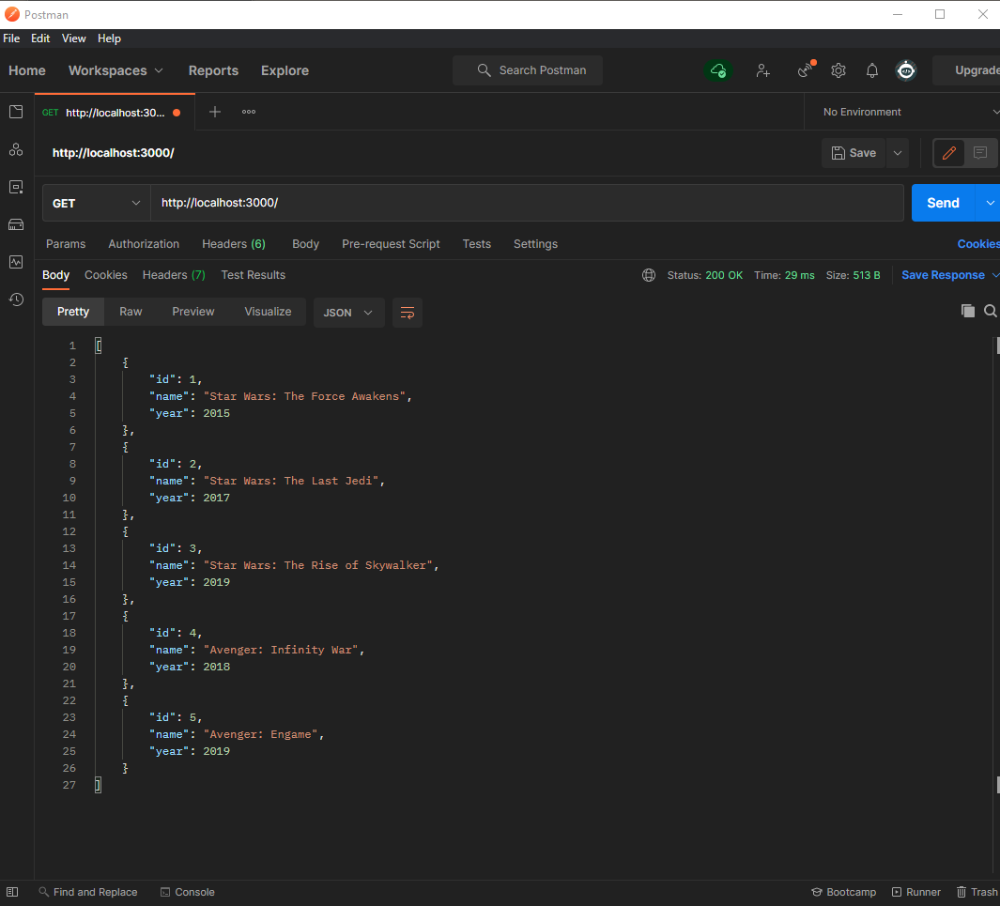

# NestJS + Docker Demo

First time set up a NestJS project with Docker for Back-End development
I'm not going to go too much in depth on NestJS or Docker since the main focus of this tutorial is to run a NestJS app environment with Docker and that's about it.

In order to fully understand how the upcoming code works, I have to learn a basic understanding of the following subjects:
-   Working with Terminal
-   JavaScript/TypeScript
-   How Docker works
- ✨Magic ✨

## Let's begin!

Creating a new NestJS application
Start by installing the NestJS CLI using npm on your machine and create a new project:

```sh
npm i -g @nestjs/cli
nest new nestjs-docker
```
I am going to choose npm for this tutorial, but you can choose yarn if you really want to.

```sh
npm run start:dev
```

## Creating a new API service

I have created a API service that returns a hardcoded array of movies to test API after containerizing it with Docker.

Run the project again using npm run start:dev and open the app in the browser at http://localhost:3000 or you can use Postman and create a new GET request for a more formatted an semantic workflow.
The final result should look like this:

``

##  Let's Dockerize this!
Now that I have  Back-End API app up and running, let's containerize it using Docker for development.

Start by creating the following files in the project's root directory:

-   Dockerfile - This file will be responsible for importing the Docker images, divide them into development and production environments, copying all of our files and install npm dependencies
-   docker-compose.yml - This file will be responsible for defining our containers, required images for the app other services, storage volumes, environment variables, etc...

##  Running the Docker containers
Now that we have defined our Docker files, we can run our app solely on Docker.
... to start our app in production mode, you guessed it... run the following command in your terminal:
```sh
docker-compose up prod
```
Make a GET request yet again to http://localhost:3000 and... voilà! Should work as expected.

P.S: If you want to ditch the terminal logging, you can run the container in a separate daemon using the -d flag like so:
```sh
docker-compose up -d prod
```
That's all!
## License

MIT


